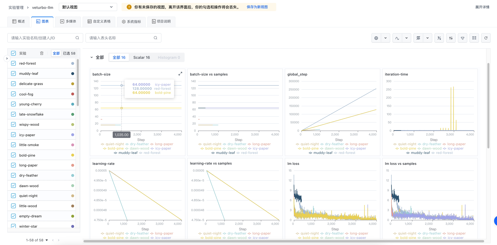

# veturbo-llm

此存储库包含用于训练、微调、评估和部署 LLM 的代码，以便快速使用火山引擎机器学习平台进行高效训练和推理。该代码库旨在易于高效、灵活地对最新技术进行快速试验，提供广大用户一个行之有效的最佳实践。

*本项目尚处于研发阶段*

## 运行环境

我们主要基于以下版本进行基础研发：

- Python >= 3.6
- PyTorch >= 2.0
- transformers >= 4.0.0

请使用火山引擎机器学习平台预置的镜像进行训练，目前支持的镜像为：

- vemlp-cn-beijing.cr.volces.com/preset-images/pytorch:2.0.0

配置任务相关的软件环境可以通过 `pip` 命令进行安装：

```bash
pip install -r requirements.txt
```


## 快速开始
我们将在此提供一个快速开始的例子，以便您快速上手。请修改 [config.yaml](config.yaml) 中的配置，然后运行以下命令：

```bash
volc ml_task submit --conf config.yaml
```

### 预训练

我们提供了很多的预置脚本，支持以下不同规模的模型训练，请参考 [scripts/pretrain](scripts/pretrain) 目录下的脚本。


以下是一个启动预训练任务的例子：
```bash
python scripts/pretrain/train.py --config_file configs/llama7b.yaml
```

### SFT
将代码进行简单的调整可以用于支持 SFT 训练任务，我们也同样提供了一个示例：
```bash
python scripts/sft_train/train.py --config_file configs/llama7b_sft.yaml
```

## 配置文件
完整的配置可以参考 [veturbollm/config.py](veturbollm/config.py) 文件。


## 训练性能

我们在 llama 模型上进行了测试，以下是一些测试结果：


| Model      | GPU Type  | Card Nums | TFLOPs | Throughput(tokens/gpu/s)    |
| ---------- | --------- | --------- | ------ | --------------------------- |
| llama-13b  | A100-80G  | 32        | 200.5  | 2486                        |
| llama-13b  | A100-80G  | 64        | 201.6  | 2501                        |


## 特性
### 火山引擎机器学习功能集成
我们集成了实验管理的功能用于跟踪实验进度。给 veturbo-llm 任务启动实验管理功能只需要在启动任务的时候增加以下环境变量：

```bash
export MLP_TRACKING_ENABLE=true
export MLP_TRACKING_PROJECT_NAME=veturbo-llm
export VOLC_ACCESSKEY=xxx
export VOLC_SECRETKEY=xxx
export VOLC_REGION=cn-beijing
```

这些环境变量也可以通过配置文件进行配置，例如在 config.yaml 中增加：

```yaml
Envs:
  - Name: "MLP_TRACKING_ENABLE"
    Value: "true"
  - Name: "MLP_TRACKING_PROJECT_NAME"
    Value: "veturbo-llm"
  - ...
```




### 基于 FSDP 的分布式训练策略
我们在并行策略上主要支持了 FSDP 方式来支持多机多卡训练。当前主流的训练框架例如 Megatron-LM、Colossal AI 实现了例如张量并行、流水线并行等并行策略，这些策略的实现对模型并行性能有了更好的把控，但是却牺牲了算法工程师的灵活性。我们认为 FSDP 方式是一个更好的选择，它可以在不牺牲灵活性的前提下，实现高效的多机多卡训练。相比于让算法工程师去学习并行策略下的模型实现，FSDP 可以让算法工程师几乎保持与传统 DDP 相同的开发体验。

### 高性能算子/算法支持
在模型层面，veturbo-llm 主要支持了以下几个方面的优化：
- Flash Attention 算子；
- Fuse-LayerNorm 算子；

## 正在进行中的
我们正在完成更多的功能支持，包括但不限于：
- [ ] 模型保存与评估;
- [ ] 更多优化算法支持：alibi 等;
- [ ] 增加对 Megatron-LM 训练支持；
- [ ] 提供部署模块，并支持一键部署到火山引擎机器学习平台；

## 相关项目

我们从以下项目获得了非常多的灵感，在此表示感谢：
- [NVIDIA/Megatron-LM](https://github.com/NVIDIA/Megatron-LM)
- [microsoft/DeepSpeed](https://github.com/microsoft/DeepSpeed)
- [huggingface/transformers](https://github.com/huggingface/transformers)
- [mosaicml/llm-foundry](https://github.com/mosaicml/llm-foundry)


